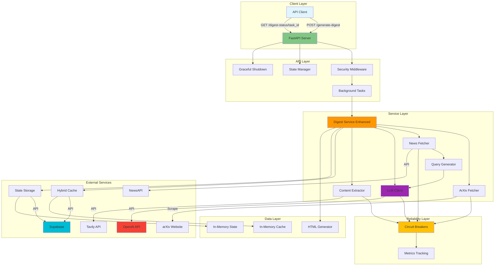
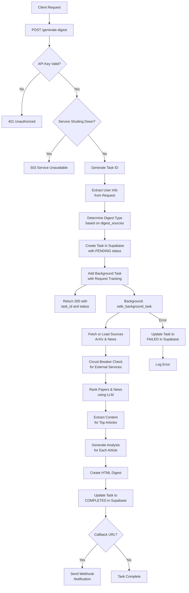
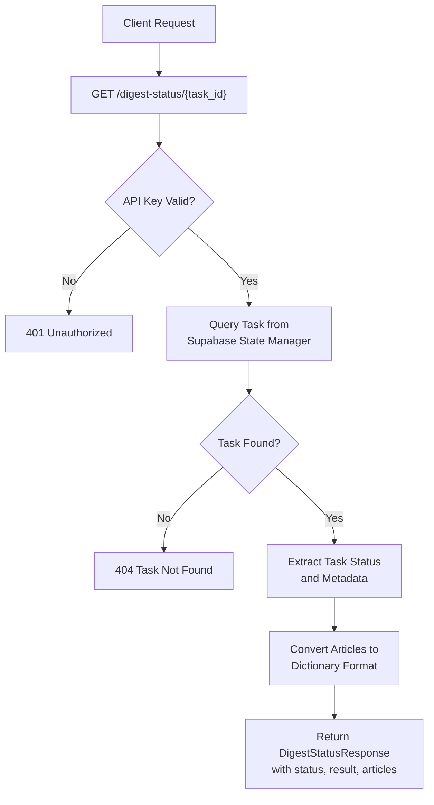
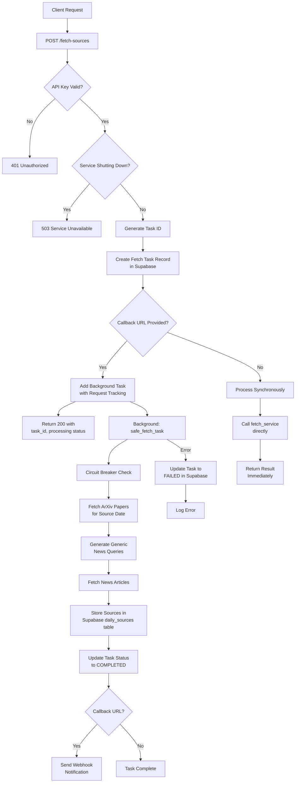
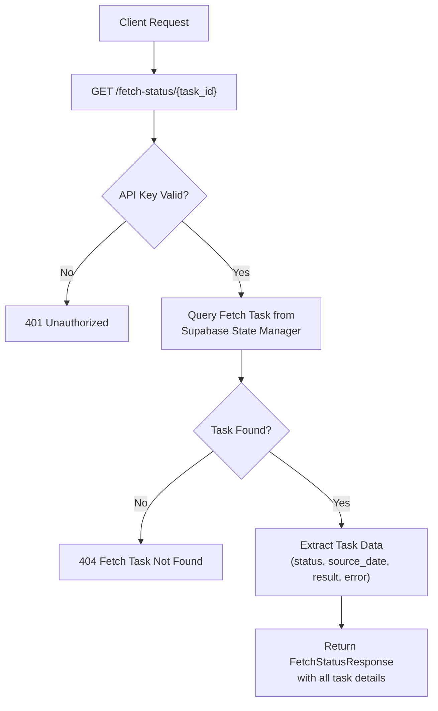
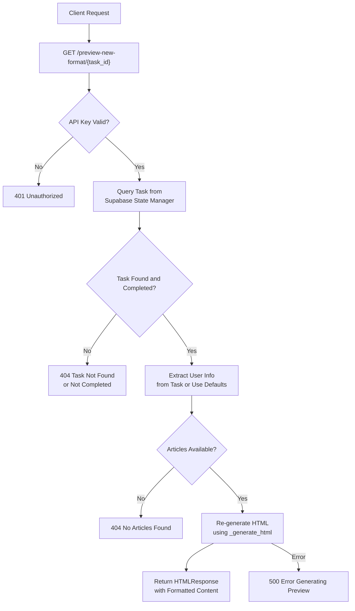
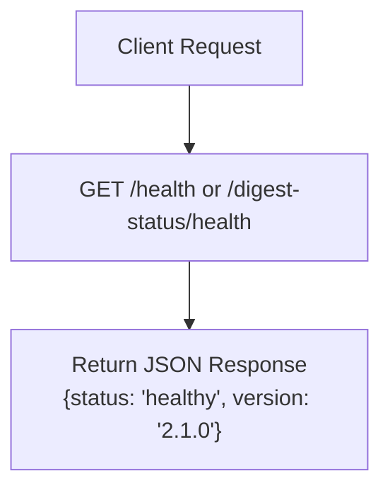
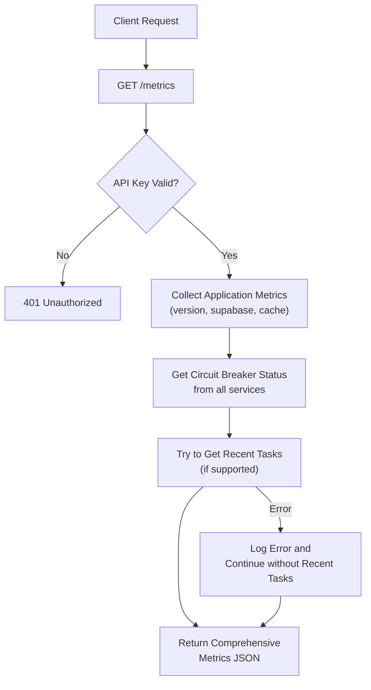
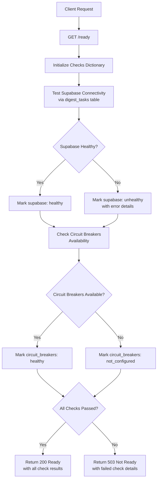

# Paperboy: AI-Powered Research Digest System

## Overview

Paperboy is an intelligent research assistant that automatically curates personalized digests of academic papers and industry news. The system leverages OpenAI's language models to rank and analyze content from arXiv (academic papers) and NewsAPI (industry news) based on individual researcher profiles, delivering tailored insights through beautifully formatted HTML digests.

The system includes enhanced reliability features including circuit breakers, Supabase integration for distributed state management, graceful shutdown handling, and comprehensive error handling to ensure robust operation in production environments.

## Core Purpose

The system addresses the information overload problem faced by researchers and technical professionals by:

- Automatically fetching the latest academic papers from arXiv
- Discovering relevant industry news through intelligent query generation
- Ranking content based on personal research interests and goals
- Providing in-depth analysis of the most relevant materials
- Delivering curated digests with actionable insights

## Technology Stack

- **Language**: Python 3.10+
- **Web Framework**: FastAPI with async/await patterns
- **AI/ML**: OpenAI GPT-4 for ranking and analysis
- **External APIs**:
  - arXiv for academic papers
  - NewsAPI for industry news
  - Tavily for content extraction
  - Supabase for distributed state and caching
- **HTTP Client**: httpx (lightweight, async)
- **HTML Parsing**: BeautifulSoup4 with lxml
- **State Management**: Supabase (distributed) with in-memory fallback
- **Reliability**: Circuit breakers, graceful shutdown, retry logic
- **Containerization**: Docker with security hardening
- **Deployment**: Google Cloud Run with auto-scaling
- **Monitoring**: Logfire for production observability

## Architecture Overview



## Main Components

### 1. **API Layer** (`src/main.py`)

- FastAPI application with async request handling
- RESTful endpoints for digest generation, source fetching, and status checking
- Background task execution for long-running operations
- API key authentication via middleware
- Health check endpoints for monitoring
- Two-phase operation support (fetch sources → generate digest)

### 2. **Digest Service** (`src/digest_service_enhanced.py`)

- Orchestrates the complete digest generation workflow
- Coordinates parallel fetching of papers and news
- Manages content ranking and analysis pipeline
- Generates formatted HTML output
- Handles webhook callbacks for task completion

### 3. **Content Fetchers**

#### ArXiv Fetcher (`src/fetcher_lightweight.py`)

- Scrapes daily computer science papers from arXiv catchup pages
- Parses HTML to extract paper metadata
- Supports connection pooling for performance
- Handles multiple arXiv categories

#### News Fetcher (`src/news_fetcher.py`)

- Integrates with NewsAPI for industry news
- Implements intelligent deduplication
- Rate limiting and caching strategies
- Relevance scoring based on query matches

### 4. **Intelligence Layer**

#### LLM Client (`src/llm_client.py`)

- Direct OpenAI API integration (replaced pydantic-ai)
- Separate ranking for papers and news with structured outputs
- Individual summary generation for papers and news
- Final digest creation from summaries
- Retry logic with exponential backoff
- Mixed content ranking with type awareness

#### Query Generator (`src/query_generator.py`)

- AI-powered news query generation
- Extracts queries from user profiles
- Temporal awareness for recent news
- Company and role-based query optimization

### 5. **Content Processing**

#### Content Extractor (`src/content_extractor.py`)

- Tavily API integration for full article extraction
- Priority-based extraction with quota management
- Batch processing with rate limiting
- Fallback content strategies

#### Fetch Service (`src/fetch_service.py`)

- Daily source pre-fetching for batch processing
- Stores fetched content in Supabase `daily_sources` table
- Generic news queries for broad coverage
- Background task support with callbacks
- SSL retry logic for Supabase operations

### 6. **Infrastructure Components**

#### State Management

##### State Management (`src/state_supabase.py`)

- Supabase-based distributed state management
- Enables higher concurrency in Cloud Run
- Task state stored in `digest_tasks` table

#### Cache System

##### In-Memory Cache (`src/cache.py`)

- TTL-based in-memory caching (fallback)
- Reduces redundant API calls
- Automatic expiration handling

##### Hybrid Cache (`src/cache_supabase.py`)

- Two-tier caching: in-memory LRU + Supabase persistence
- Distributed cache sharing across instances
- Cache entries stored in `cache_entries` table
- Automatic synchronization between tiers

#### Reliability Components

##### Circuit Breaker (`src/circuit_breaker.py`)

- Prevents cascading failures from external services
- Automatic service recovery detection
- Per-service circuit breaker instances
- State optionally persisted to Supabase

##### Graceful Shutdown (`src/graceful_shutdown.py`)

- Proper SIGTERM handling for Cloud Run
- Tracks in-flight requests
- Configurable shutdown timeout
- Ensures clean task completion

##### Metrics (`src/metrics.py`)

- Performance monitoring
- API call tracking
- Success/failure rates
- Latency measurements

#### Security (`src/security.py`)

- API key validation middleware
- FastAPI dependency injection
- Header-based authentication

## FastAPI Endpoint Flow Diagrams

The system provides several RESTful endpoints for digest generation, source fetching, and monitoring. Below are detailed flow diagrams for each endpoint showing their internal processing logic, error handling, and integration with external services.

### Endpoint Summary

| Endpoint                           | Method | Authentication | Purpose                             | Key Features                                               |
| ---------------------------------- | ------ | -------------- | ----------------------------------- | ---------------------------------------------------------- |
| `/generate-digest`                 | POST   | Required       | Create personalized research digest | Background processing, circuit breakers, webhook callbacks |
| `/digest-status/{task_id}`         | GET    | Required       | Check digest generation status      | Real-time status polling, result retrieval                 |
| `/fetch-sources`                   | POST   | Required       | Pre-fetch daily sources             | Two-phase operation, async/sync modes                      |
| `/fetch-status/{task_id}`          | GET    | Required       | Check source fetching status        | Task progress monitoring                                   |
| `/preview-new-format/{task_id}`    | GET    | Required       | Preview HTML digest format          | On-demand HTML regeneration                                |
| `/health`, `/digest-status/health` | GET    | None           | Basic health checks                 | Load balancer probes                                       |
| `/metrics`                         | GET    | Required       | Application metrics                 | Circuit breaker status, recent tasks                       |
| `/ready`                           | GET    | None           | Readiness probe                     | Dependency health validation                               |

### POST /generate-digest

Main endpoint for creating personalized research digests with AI-powered analysis.



### GET /digest-status/{task_id}

Status polling endpoint for checking digest generation progress and retrieving results.



### POST /fetch-sources

Two-phase operation endpoint for pre-fetching daily sources to optimize batch processing.



### GET /fetch-status/{task_id}

Status polling endpoint for source fetching tasks.



### GET /preview-new-format/{task_id}

HTML preview endpoint for regenerating and viewing digest formatting.



### Monitoring and Health Check Endpoints

#### GET /health & GET /digest-status/health

Basic health check endpoints for load balancer and uptime monitoring.



#### GET /metrics

Comprehensive application metrics for monitoring and debugging.



#### GET /ready

Cloud Run readiness probe with dependency health checks.



## Data Flow

### Option 1: Direct Digest Generation

1. **Request Initiation**

   - Client sends user profile and preferences to `/generate-digest`
   - System creates task ID and returns immediately
   - Background task begins processing

2. **Content Discovery**

   - ArXiv fetcher scrapes latest CS papers
   - Query generator creates personalized news searches
   - News fetcher retrieves relevant articles
   - Both sources fetched in parallel

3. **Intelligent Ranking**

   - Papers and news ranked separately by LLM
   - Top N items selected from each category
   - Preserves balance between content types

4. **Deep Analysis**

   - Content extractor fetches full text for news
   - Papers and news processed in parallel
   - Individual summaries generated for each item

5. **Digest Generation**

   - Final digest created from all summaries
   - Separate sections for papers and news
   - Rich metadata and visual styling
   - Mobile-responsive design

6. **Result Delivery**
   - Task status updated to completed
   - Client polls `/digest-status/{task_id}` for results
   - Optional webhook callback notification

### Option 2: Two-Phase Operation (Recommended for batch processing)

1. **Daily Source Fetching**

   - Admin/scheduler calls `/fetch-sources` with date
   - System fetches all ArXiv papers for that date
   - Generic news queries fetch broad tech news
   - Sources stored in Supabase `daily_sources` table

2. **Digest Generation with Pre-fetched Sources**
   - Client sends request with `source_date` parameter
   - System loads pre-fetched sources from Supabase
   - Ranking and analysis proceed with cached content
   - Significantly faster digest generation

## Key Design Patterns

- **Async/Await**: All I/O operations use async patterns for scalability
- **Dependency Injection**: Configuration management via Pydantic BaseSettings
- **Background Tasks**: Long operations handled asynchronously
- **Circuit Breaker**: Prevents cascading failures with automatic recovery
- **Graceful Shutdown**: Clean termination with request tracking
- **Hybrid Caching**: Two-tier cache system for performance and distribution
- **Distributed State**: Enables horizontal scaling with Supabase
- **Rate Limiting**: Semaphore-based concurrency control
- **Type Safety**: Comprehensive Pydantic models throughout
- **Fallback Strategies**: Automatic degradation to in-memory when external services fail

## Configuration

The system uses environment-based configuration with sensible defaults:

### Core Configuration

- `OPENAI_API_KEY`: OpenAI API access (required)
- `API_KEY`: Authentication for API endpoints (required)
- `OPENAI_MODEL`: Model selection (default: gpt-4.1-mini-2025-04-14)
- `TOP_N_ARTICLES`: Number of papers to analyze (default: 5)
- `TOP_N_NEWS`: Number of news articles to analyze (default: 5)
- `LOG_LEVEL`: Logging verbosity (default: INFO)

### Performance Settings

- `HTTP_TIMEOUT`: HTTP request timeout in seconds (default: 30)
- `TASK_TIMEOUT`: Max digest generation time (default: 300s)
- `AGENT_RETRIES`: LLM retry attempts (default: 2)
- `ANALYSIS_CONTENT_MAX_CHARS`: Max content for analysis (default: 20000)
- `RANKING_INPUT_MAX_ARTICLES`: Max articles for ranking (default: 30)
- `EXTRACT_MAX_CONCURRENT`: Concurrent extraction limit (default: 5)
- `EXTRACT_TIMEOUT`: Per-extraction timeout (default: 30s)
- `SHUTDOWN_TIMEOUT`: Graceful shutdown timeout (default: 30s)

### Feature Toggles

- `NEWS_ENABLED`: Enable news fetching (default: true)
- `NEWS_MAX_ARTICLES`: Max news articles to fetch (default: 50)
- `NEWS_MAX_EXTRACT`: Max articles to extract full content (default: 10)
- `NEWS_CACHE_TTL`: News cache duration in seconds (default: 3600)

### External Services

- `NEWSAPI_KEY`: NewsAPI key for news fetching (optional)
- `TAVILY_API_KEY`: Tavily API key for content extraction (optional)
- `SUPABASE_URL`: Supabase project URL (required)
- `SUPABASE_KEY`: Supabase anon key (required)

### Deployment Settings

- `USE_LIGHTWEIGHT`: Use httpx instead of Playwright (default: true)
- `LOGFIRE_TOKEN`: Monitoring service token (optional)

## Deployment Architecture

- **Container**: Lightweight Docker image with security hardening
- **Memory**: 512Mi for lightweight version (reduced from 1Gi)
- **Scaling**: Auto-scales 0-50 instances based on demand
- **Concurrency**: Set to 5 with Supabase distributed state
- **Security**:
  - Non-root user (UID 10001)
  - Read-only filesystem with tmpfs mounts
  - Dropped capabilities except NET_BIND_SERVICE
  - No-new-privileges security option
- **Health Checks**: Available at `/digest-status/health`
- **Monitoring**: Integrated Logfire for production observability
- **Graceful Shutdown**: Proper SIGTERM handling for Cloud Run

### Supabase Schema Requirements

The following tables are required in Supabase:

```sql
-- Task state storage
CREATE TABLE digest_tasks (
    id UUID PRIMARY KEY DEFAULT gen_random_uuid(),
    task_id TEXT UNIQUE NOT NULL,
    status TEXT NOT NULL,
    user_info JSONB,
    result JSONB,
    error TEXT,
    source_date TEXT,
    digest_type TEXT,
    created_at TIMESTAMP WITH TIME ZONE DEFAULT NOW(),
    updated_at TIMESTAMP WITH TIME ZONE DEFAULT NOW()
);

-- Daily source storage
CREATE TABLE daily_sources (
    id UUID PRIMARY KEY DEFAULT gen_random_uuid(),
    source_date TEXT UNIQUE NOT NULL,
    arxiv_papers JSONB,
    news_articles JSONB,
    fetch_status TEXT,
    fetch_metadata JSONB,
    error TEXT,
    created_at TIMESTAMP WITH TIME ZONE DEFAULT NOW(),
    updated_at TIMESTAMP WITH TIME ZONE DEFAULT NOW()
);

-- Fetch task tracking
CREATE TABLE fetch_tasks (
    id UUID PRIMARY KEY DEFAULT gen_random_uuid(),
    task_id TEXT UNIQUE NOT NULL,
    status TEXT NOT NULL,
    result JSONB,
    error TEXT,
    created_at TIMESTAMP WITH TIME ZONE DEFAULT NOW(),
    updated_at TIMESTAMP WITH TIME ZONE DEFAULT NOW()
);

-- Distributed cache
CREATE TABLE cache_entries (
    key TEXT PRIMARY KEY,
    value JSONB NOT NULL,
    expires_at TIMESTAMP WITH TIME ZONE NOT NULL,
    created_at TIMESTAMP WITH TIME ZONE DEFAULT NOW()
);

-- Circuit breaker state (optional)
CREATE TABLE circuit_breaker_state (
    service_name TEXT PRIMARY KEY,
    state TEXT NOT NULL,
    failure_count INTEGER DEFAULT 0,
    last_failure TIMESTAMP WITH TIME ZONE,
    last_success TIMESTAMP WITH TIME ZONE,
    updated_at TIMESTAMP WITH TIME ZONE DEFAULT NOW()
);
```

## Error Handling

- Comprehensive exception handling at all layers
- Graceful degradation when optional services fail
- Circuit breakers prevent cascading failures

- Detailed logging with structured context
- User-friendly error messages in API responses
- Request tracking ensures clean shutdown
- Retry logic with exponential backoff for transient failures
- SSL retry logic for Supabase operations
