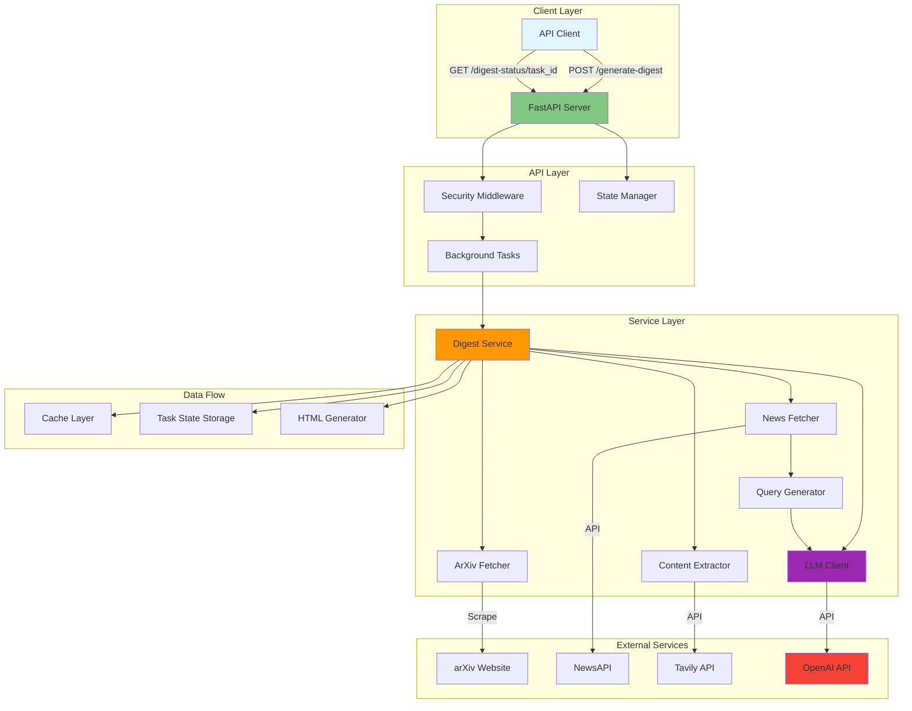

# Paperboy: AI-Powered Research Digest System

## Overview

Paperboy is an intelligent research assistant that automatically curates personalized digests of academic papers and industry news. The system leverages OpenAI's language models to rank and analyze content from arXiv (academic papers) and NewsAPI (industry news) based on individual researcher profiles, delivering tailored insights through beautifully formatted HTML digests.

## Core Purpose

The system addresses the information overload problem faced by researchers and technical professionals by:

- Automatically fetching the latest academic papers from arXiv
- Discovering relevant industry news through intelligent query generation
- Ranking content based on personal research interests and goals
- Providing in-depth analysis of the most relevant materials
- Delivering curated digests with actionable insights

## Technology Stack

- **Language**: Python 3.10+
- **Web Framework**: FastAPI with async/await patterns
- **AI/ML**: OpenAI GPT-4 for ranking and analysis
- **External APIs**:
  - arXiv for academic papers
  - NewsAPI for industry news
  - Tavily for content extraction
- **HTTP Client**: httpx (lightweight, async)
- **HTML Parsing**: BeautifulSoup4 with lxml
- **Containerization**: Docker with security hardening
- **Deployment**: Google Cloud Run with auto-scaling
- **Monitoring**: Logfire for production observability

## Architecture Overview

## Main Components

### 1. **API Layer** (`src/main.py`)

- FastAPI application with async request handling
- RESTful endpoints for digest generation and status checking
- Background task execution for long-running operations
- API key authentication via middleware
- Health check endpoints for monitoring

### 2. **Digest Service** (`src/digest_service.py`)

- Orchestrates the complete digest generation workflow
- Coordinates parallel fetching of papers and news
- Manages content ranking and analysis pipeline
- Generates formatted HTML output
- Handles webhook callbacks for task completion

### 3. **Content Fetchers**

#### ArXiv Fetcher (`src/fetcher_lightweight.py`)

- Scrapes daily computer science papers from arXiv catchup pages
- Parses HTML to extract paper metadata
- Supports connection pooling for performance
- Handles multiple arXiv categories

#### News Fetcher (`src/news_fetcher.py`)

- Integrates with NewsAPI for industry news
- Implements intelligent deduplication
- Rate limiting and caching strategies
- Relevance scoring based on query matches

### 4. **Intelligence Layer**

#### LLM Client (`src/llm_client.py`)

- Direct OpenAI API integration
- Handles paper and news ranking with structured outputs
- Performs deep content analysis
- Retry logic with exponential backoff
- Mixed content ranking with type awareness

#### Query Generator (`src/query_generator.py`)

- AI-powered news query generation
- Extracts queries from user profiles
- Temporal awareness for recent news
- Company and role-based query optimization

### 5. **Content Processing**

#### Content Extractor (`src/content_extractor.py`)

- Tavily API integration for full article extraction
- Priority-based extraction with quota management
- Batch processing with rate limiting
- Fallback content strategies

### 6. **Infrastructure Components**

#### State Manager (`src/state.py`)

- In-memory task state persistence
- Thread-safe operations with asyncio locks
- Task lifecycle management

#### Cache System (`src/cache.py`)

- TTL-based in-memory caching
- Reduces redundant API calls
- Automatic expiration handling

#### Security (`src/security.py`)

- API key validation middleware
- FastAPI dependency injection
- Header-based authentication

## Data Flow

1. **Request Initiation**

   - Client sends user profile and preferences to `/generate-digest`
   - System creates task ID and returns immediately
   - Background task begins processing

2. **Content Discovery**

   - ArXiv fetcher scrapes latest CS papers
   - Query generator creates personalized news searches
   - News fetcher retrieves relevant articles
   - Both sources fetched in parallel

3. **Intelligent Ranking**

   - LLM analyzes all content against user profile
   - Mixed ranking considers both papers and news
   - Top N items selected based on relevance scores

4. **Deep Analysis**

   - Content extractor fetches full text for top items
   - LLM performs detailed analysis of each item
   - Generates summaries, key findings, and recommendations

5. **Digest Generation**

   - HTML generator creates formatted output
   - Separate sections for papers and news
   - Rich metadata and visual styling
   - Mobile-responsive design

6. **Result Delivery**
   - Task status updated to completed
   - Client polls `/digest-status/{task_id}` for results
   - Optional webhook callback notification

## Key Design Patterns

- **Async/Await**: All I/O operations use async patterns for scalability
- **Dependency Injection**: Configuration management via Pydantic BaseSettings
- **Background Tasks**: Long operations handled asynchronously
- **Circuit Breaker**: Graceful degradation when external services fail
- **Rate Limiting**: Semaphore-based concurrency control
- **Type Safety**: Comprehensive Pydantic models throughout

## Configuration

The system uses environment-based configuration with sensible defaults:

- **Core**: OpenAI API key, model selection, authentication
- **Performance**: Timeouts, retry attempts, concurrency limits
- **Features**: News integration toggles, cache TTL
- **Deployment**: Cloud Run specific settings

## Deployment Architecture

- **Container**: Lightweight Docker image with security hardening
- **Scaling**: Auto-scales 0-50 instances based on demand
- **Concurrency**: Set to 1 due to in-memory state management
- **Security**: Non-root user, read-only filesystem, dropped capabilities
- **Monitoring**: Integrated Logfire for production observability

## Error Handling

- Comprehensive exception handling at all layers
- Graceful degradation when optional services fail
- Detailed logging with structured context
- User-friendly error messages in API responses
